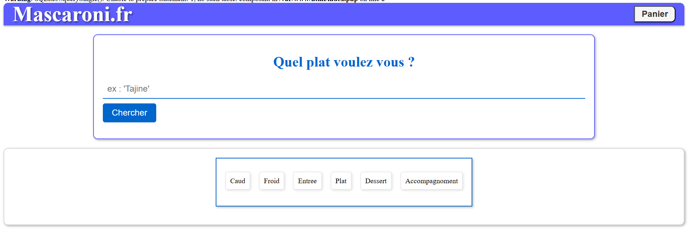
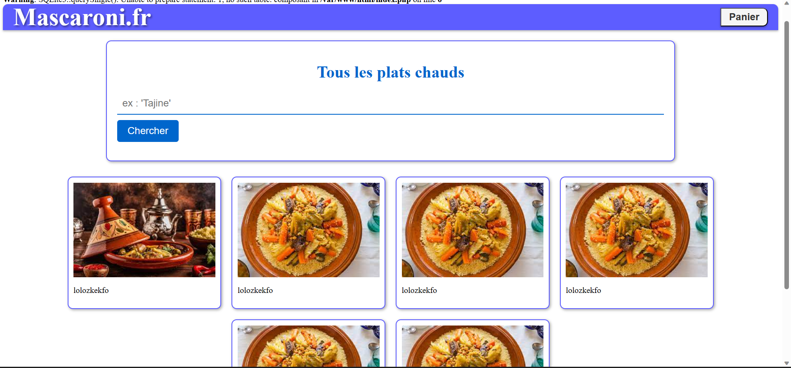
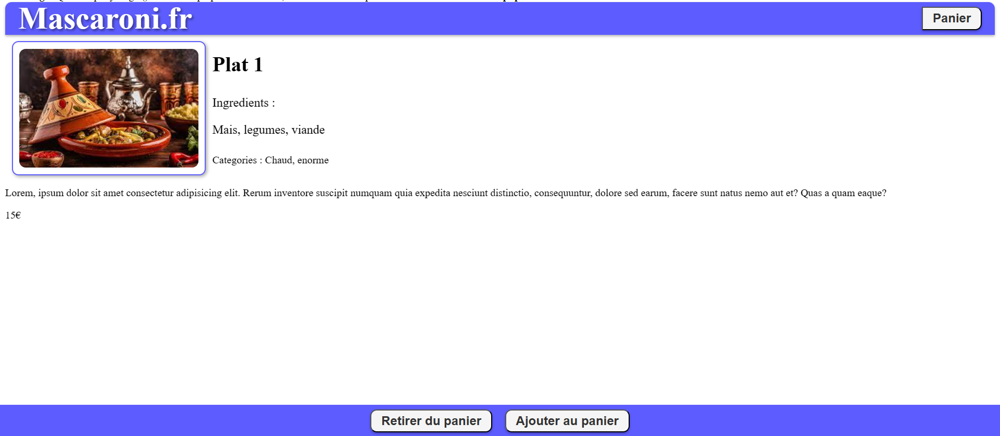

# R209
R209 - Web

## https://www.recettesdici.com/fr/categorie-de-plat/

[x] rechercher une catégorie
[] page plat
[] Session (php), $_SESSION
[] panier link avec un user
[] authentification
## Pour acceder au serveur de developpement
Bien sur il faudra avoir docker et docker-compose d'installé sur sa machine. Il y a des tutos sur internet pour l'installation de ces deux trucs.
- Cloner le repo
```bash
    git clone https://github.com/Tutanka01/R209
```
- Se placer dans le dossier R209
```bash
    cd R209
```
- Saisir la commande suivante dans le terminal
  
```bash
    docker-compose up -d
```
- Aller sur http://localhost:8080
## Voila a quoi ça ressemble par le moment 
Mainpage :


Categories :


Plats :


Panier :
