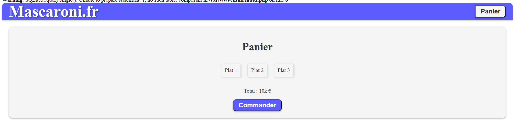

# R209
R209 - Web

## https://www.recettesdici.com/fr/categorie-de-plat/

- [x] rechercher une catégorie

<<<<<<< HEAD
[x] page plat (julien, quasi fini) : ajouter une qte à ajouter au panier.
=======
- [x] page plat (mohamad, quasi fini) : ajouter une qte à ajouter au panier.
>>>>>>> 3cd9c3fb1056627cb73af6eb6b49218901506e63

- [x] Session (php), $_SESSION, pour track et mettre le panier besoin de login/mdp + 'nouvel utilisateur ?' (mohamad)

- [x] panier link avec un user (mohamad)

- [] Admin page (julien)

- [] Liaison login admin -> admin page (mohamad)

- [] Accès gestionnaire --> admin page (julein)

- [] Filtre anti_injectionSQL (julien)

- [] Avis des utilisateurs (mohamad)

- [x] Plus de plats (Mohamad)//FIN
- [ ] 
## Pour acceder faire marcher le projet
Bien sur il faudra avoir docker et docker-compose d'installé sur sa machine. Il y a des tutos sur internet pour les installer.
- Cloner le repo
```bash
    git clone https://github.com/Tutanka01/R209
```
- Se placer dans le dossier R209
```bash
    cd R209
```
- Saisir la commande suivante dans le terminal
  
```bash
    docker-compose up
```
- Aller sur http://localhost:8000
## Voila a quoi ça ressemble par le moment 
Mainpage :


Categories :


Plats :


Panier :
